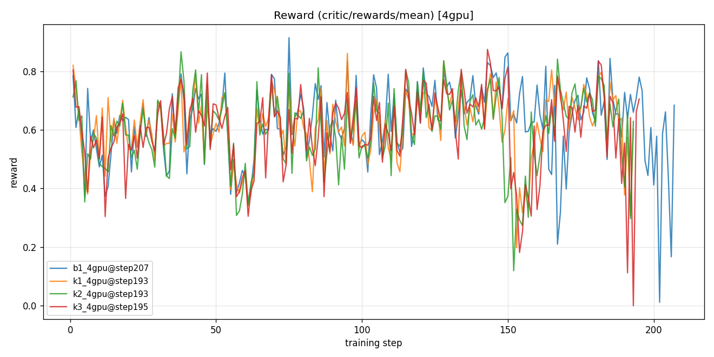
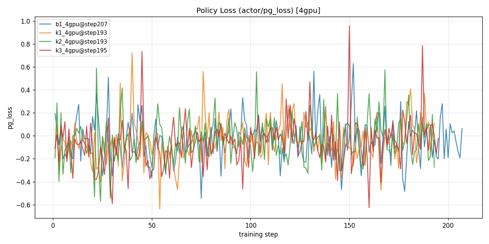
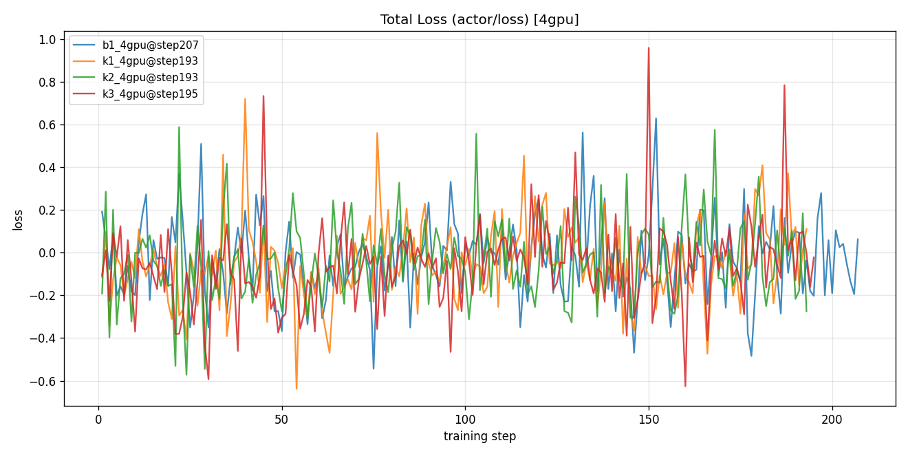
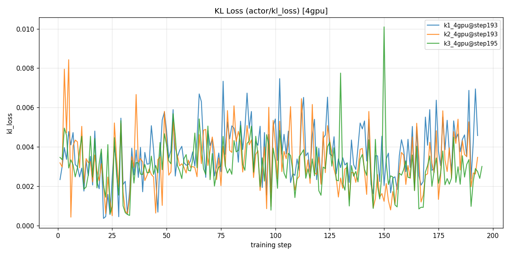
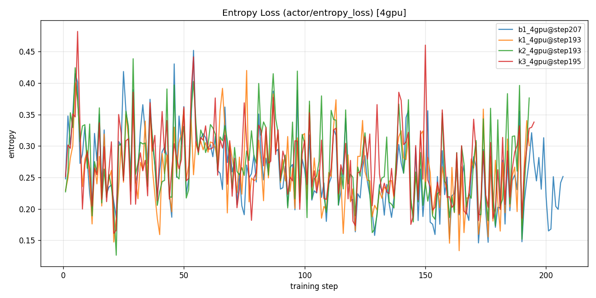
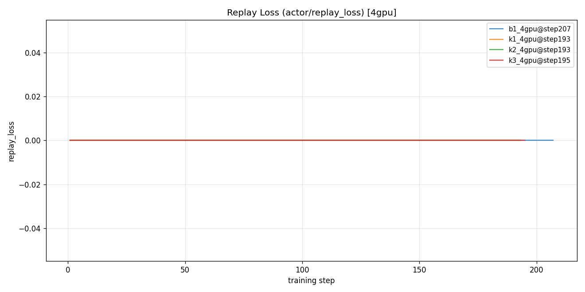

# 4卡训练(~200step)Reward / Loss 趋势总结

> 数据来源:`logs/metrics/qwen35_9b_{b1,k1,k2,k3}_4gpu/metrics.jsonl`
> 图:`doc/debug/plots_4gpu/*.png`(每指标一张,4实验叠加,图例含各自最后 step)
> 生成脚本:`scripts/plot_metrics_compare.py`
> 记录时间:2026-08-04 · 关联 RunLog §62(这批 run 的死亡原因)

## 背景

4 卡 b1 / k1 / k2 / k3 四个实验(08-02 起),用**旧 reward**训练到 step 193~207,随后全部
死于**图片 M-RoPE 崩 → refcount 泄漏 → pause_generation 死锁**(详见 RunLog §62)。
本文档汇总它们死锁前的 reward / loss 趋势,供分析对比。对应 ckpt 已加 `_old` 后缀归档
(`ckpts/qwen35_9b_*_4gpu_old/`),**不用于新 reward 实验的续训/init**。

- **replay_loss 全程 = 0**:这批是 buffer 未启用回放的阶段(b1 是 baseline 本就无 replay;
  k 系列此阶段 replay 系数为 0),故 CL replay 分量为 0,属预期。
- b1 无 kl_loss 记录(baseline 不含 KL 项)。

---

## 一、总体结论

- **四条曲线高度重合**,训练动力学相似且平稳:reward 常驻 **0.55~0.85**,pg_loss 在
  **0 附近震荡**(GRPO 健康形态,非单调下降),KL 极小(0.003~0.004)且稳定,熵缓降(探索
  逐步收敛),**均无发散、无坍缩**。
- **step ~150 附近有共同深谷**(reward 骤跌到 0.1~0.2),之后回升 —— 时间与 §62 死亡链
  吻合,是那段撞上图片崩 / rollout 批量失败所致,非训练本身问题。
- 末段(step 190+)k 系列在 ~193 因死锁停止,b1 延续到 207。
- reward 的极小值(k3 的 0.0、b1 的 0.012)是**单步空批**(图片崩那步整批失败),不是趋势。

---

## 二、逐指标趋势(数值)

三段均值 = 把训练过程等分前/中/后三段各取均值,看走向。

### Reward(critic/rewards/mean)

| 实验 | step | 首 | 末 | max | min | 三段均值(前/中/后) |
|------|------|------|------|------|------|------|
| b1 | 1~207 | 0.785 | 0.684 | 0.915 | 0.012 | 0.585 / 0.655 / 0.636 |
| k1 | 1~193 | 0.820 | 0.603 | 0.861 | 0.198 | 0.585 / 0.617 / 0.634 |
| k2 | 1~193 | 0.712 | 0.629 | 0.866 | 0.120 | 0.577 / 0.613 / 0.612 |
| k3 | 1~195 | 0.804 | 0.705 | 0.875 | 0.000 | 0.581 / 0.627 / 0.605 |

**趋势**:四者都是"前段 ~0.58 → 中后段 ~0.61~0.65"的**温和上升后走平**,幅度不大但方向一致
向好。b1 波动幅度最大(max 0.915)。

### pg_loss / total_loss(actor/pg_loss ≈ actor/loss)

| 实验 | 首 | 末 | max | min | 三段均值 |
|------|------|------|------|------|------|
| b1 | 0.192 | 0.063 | 0.630 | -0.543 | -0.048 / -0.008 / -0.038 |
| k1 | -0.115 | 0.111 | 0.721 | -0.638 | -0.102 / 0.006 / -0.039 |
| k2 | -0.192 | -0.274 | 0.589 | -0.571 | -0.072 / -0.023 / -0.018 |
| k3 | -0.106 | -0.022 | 0.960 | -0.626 | -0.124 / -0.027 / -0.036 |

**趋势**:全部**围绕 0 小幅震荡**(三段均值绝对值均 <0.13),无系统性漂移 —— GRPO policy
loss 的正常形态,表明策略更新稳定、无坍缩。total_loss 与 pg_loss 几乎相等(此阶段其它
损失分量近 0)。

### KL loss(actor/kl_loss;b1 无)

| 实验 | 首 | 末 | max | min | 三段均值 |
|------|------|------|------|------|------|
| k1 | 0.0023 | 0.0046 | 0.0075 | 0.0004 | 0.003 / 0.004 / 0.004 |
| k2 | 0.0032 | 0.0035 | 0.0084 | 0.0004 | 0.003 / 0.004 / 0.003 |
| k3 | 0.0035 | 0.0030 | 0.0101 | 0.0005 | 0.003 / 0.003 / 0.003 |

**趋势**:**极小且平稳**(~0.003~0.004),策略始终贴近参考分布,无偏离风险。

### Entropy(actor/entropy_loss)

| 实验 | 首 | 末 | max | min | 三段均值 |
|------|------|------|------|------|------|
| b1 | 0.248 | 0.251 | 0.452 | 0.146 | 0.297 / 0.248 / 0.235 |
| k1 | 0.229 | 0.300 | 0.420 | 0.134 | 0.273 / 0.267 / 0.242 |
| k2 | 0.227 | 0.376 | 0.439 | 0.126 | 0.290 / 0.283 / 0.252 |
| k3 | 0.251 | 0.338 | 0.482 | 0.161 | 0.290 / 0.271 / 0.259 |

**趋势**:**缓慢下降**(前段 ~0.29 → 后段 ~0.24~0.26),策略探索随训练逐步收敛,符合预期,
未过早坍缩(熵未跌到接近 0)。

### Replay loss(actor/replay_loss)

全部实验全程 **= 0**(此阶段未启用 buffer 回放,见背景说明)。

---

## 三、图(每指标一张,4实验叠加)

### Reward

### Policy Loss(pg_loss)

### Total Loss

### KL Loss

### Entropy Loss

### Replay Loss(全程 0)

